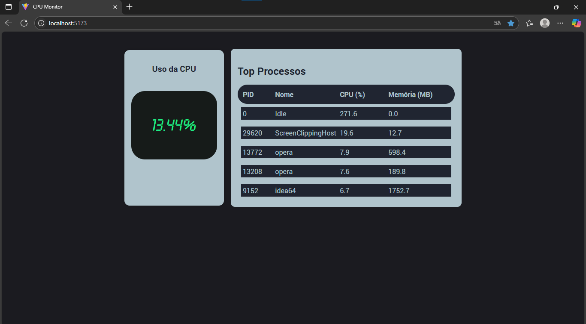

# cpu-monitor-react




> Projeto desenvolvido em React que exibe o uso da CPU em tempo real, consumindo dados de uma API local.

### 🔧 Ajustes e melhorias

O projeto ainda está em desenvolvimento e as próximas atualizações serão:

- [x] Exibir uso da CPU em tempo real
- [x] Estilizar com `styled-components`
- [x] Responsividade básica


---

## 💻 Pré-requisitos

Antes de começar, certifique-se que você tem instalado:

- Node.js (v18+)
- npm ou yarn
- API local (consumindo dados do `os-utils` ou similar)
  
---

## 🔗 API Backend (Java)

Este projeto consome dados de uma API local feita em Java. Você pode conferir o repositório da API aqui:

👉 [Repositório da API Java (CPU Monitor)](https://github.com/RuanSpinelli/cpu-monitor-java)

---

## 🚀 Instalando o cpu-monitor-react

Para instalar o projeto, siga os passos abaixo:

```bash
git clone https://github.com/RuanSpinelli/cpu-monitor-react.git
cd cpu-monitor-react
npm install
````

---

## ☕ Usando o cpu-monitor-react

Para rodar o projeto em modo desenvolvimento:

```bash
npm run dev
```

Certifique-se de que sua API backend esteja rodando localmente em uma rota acessível (ex: `http://localhost:3001`).

---

## 📫 Contribuindo com o projeto

Para contribuir com este projeto:

1. Faça um fork
2. Crie uma nova branch: `git checkout -b minha-feature`
3. Faça suas alterações e commit: `git commit -m 'feat: minha nova feature'`
4. Envie a branch: `git push origin minha-feature`
5. Abra um Pull Request no GitHub

---

## 🤝 Colaboradores

<table>
  <tr>
    <td align="center">
      <a href="https://github.com/RuanSpinelli">
        <br>
        <sub>
          <b>Ruan Spinelli</b>
        </sub>
      </a>
    </td>
  </tr>
</table>

---

## 📝 Licença

Esse projeto está sob a licença MIT. Veja [LICENSE](./LICENSE) para mais detalhes.
